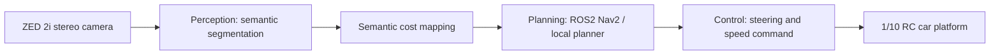

# System Architecture Overview

## Mission

산악 오프로드 환경에서 통신 지원 없이 온보드 자원만으로 지형을 인지하고 주행 의사결정에 연결한다.

## Phase 1 Scope

현재 1차 목표는 end-to-end 주행 demo가 아니라 segmentation benchmark이다. Perception model의 정확도, latency, power, costmap 변환 가능성을 먼저 정량화한 뒤 ROS2 통합 범위를 확정한다.

## High-Level Pipeline

## Research Tracks

### Perception Baselines

- YOLOv8-Seg: speed-oriented CNN baseline
- DeepLabV3+: precision-oriented CNN baseline
- SegFormer-B0/B2: transformer-based segmentation candidate

### Domain Adaptation

- RELLIS-3D 기반 off-road semantic segmentation
- class imbalance 대응: focal loss, sampling, class weighting
- 비정형 경계 대응: decoupled head 또는 model-head ablation

### Optimization

- TensorRT FP16 export for first real-time target
- INT8 calibration if FP16 is not enough for target FPS or power
- Target: at least 30 FPS on Jetson Orin NX

### Integration

- ROS2 Humble on Ubuntu 22.04
- ZED 2i image/depth/IMU input
- semantic segmentation output to costmap
- high-level control interface for 4WS RC platform
- mono repo layout with ROS2 packages under `ros2_ws/`

## Candidate Metrics

| Area | Metric |
| --- | --- |
| Segmentation | mIoU, class IoU, rare obstacle recall |
| Runtime | FPS, latency p50/p95, GPU memory |
| Edge deployment | power draw on Jetson Orin NX, TensorRT build time, engine size |
| Mapping | costmap update rate, traversability error |
| Control demo | intervention count, route completion, recovery success |

## Near-Term Milestones

1. Establish dataset access and split convention.
2. Reproduce one CNN baseline and one SegFormer baseline.
3. Compare accuracy/runtime under one fixed evaluation protocol.
4. Export the best candidate to ONNX and TensorRT FP16.
5. Connect segmentation masks to a prototype semantic costmap.
